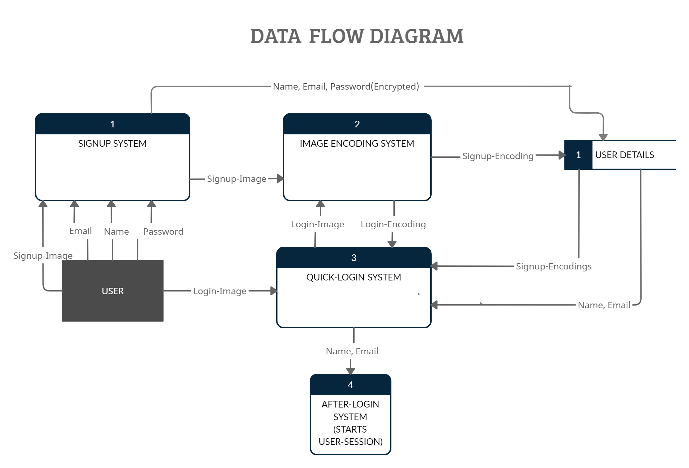

# Login System

## Problem Statement
  Face-Recognition: Develop a browser-based application or a native mobile application to demonstrate the application of Face Recognition technology. You could choose to demonstrate application of Face Recognition in any area of application of your choice.

## Overview of the project
  This project is concerned with building a face login system which can be easily integrated with different web-applications for login purposes. Once the users signup on the application, for login purposes they would not be required to remember their username and password as the system will automatically identify all the user-details just by recognizing their face.
   Face-Recognition model used in this project: [**FaceNet**](https://arxiv.org/abs/1503.03832)
   <b>NOTE: For more details about the project read the file in Documentation folder.</b>

## Functional Features
  1. Signup: The user can create an account by using his/her email-id. The password is stored in the database in encrypted form.
  2. Login: The user can login to his/her account directly just by allowing the website to take his/her photo.
  3. Logout: Users can end the session by clicking on logout button.
  4. All the images of the users are not stored in the database, only encodings generated from image are stored in binary-file. 
   <b>NOTE: Only the most recent photograph of the most recent user is stored in the project’s working directory under the folder name "Uploads" for the purpose of uploading it to the server. Apart from this no image is stored.</b>

FAQ: Why is there a need to enter password during signup if authentication will be based on face-recognition?
 
Ans. Entering password can be made optional in future in case a user doesn’t want to use face login system and continue with classical approach of authentication. (THIS FEATURE HAS NOT BEEN IMPLEMENTED AND FOR NOW ENTERING PASSWORD IS MANDATORY) 

## Data Flow Diagram
  

    
  

## How to run this application on your local-system?
  1. Install Python version 3.10.0 on your system.
  2. Clone this repository.
  3. Open the project folder in text-editor.
  4. Install the libraries and dependencies using the following command 
      #### "pip install -r requirements.txt" 
      Or you can install the libraries separately.
  5. After installing the libraries, start the server by typing the following in the terminal 
      #### "python start.py" 
  6. Load http://localhost:5000/ on web-browser of your choice to open the website.
  
